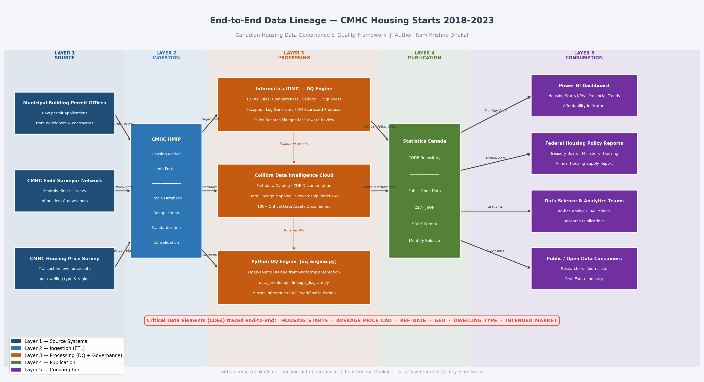

# 🏠 Canadian Housing Data Governance & Quality Framework

**An end-to-end data governance and data quality framework applied to Canadian housing data — demonstrating metadata cataloging, data lineage, stewardship, DQ rule execution, and quality scorecards.**

**Author:** Ram Krishna Dhakal  
**Tools:** Python · SQL · Collibra · Informatica IDMC  
**Dataset:** CMHC Housing Starts — Canada (2018–2023) | 10,800 records · 16 columns · 10 provinces  
**Live Dashboard:** [Interactive DQ Dashboard](https://cmhc-housing-data-governance-zaslgtkfkxi5n5agrz87th.streamlit.app)

---

## 🎯 Why This Project Exists

Canada Mortgage and Housing Corporation (CMHC) publishes housing starts data that directly feeds into federal GDP reporting, mortgage insurance thresholds, affordable housing funding allocation, and provincial policy decisions. When this data has quality issues — missing values, invalid entries, inconsistent records across systems — the downstream consequences affect billions of dollars in policy decisions.

During my **Data Quality Analyst internship at CMHC (Sept–Dec 2025)**, I worked within their established data management program using **Informatica IDMC**, **Collibra**, and **Databricks SQL** to build and validate data quality rules, perform root cause analysis, document data assets in the enterprise catalog, and collaborate with data stewards across multiple domains.

**This project applies those same enterprise governance patterns** — metadata cataloging, CDE identification, data lineage, stewardship frameworks, DQ rule design, and quality scorecards — to a publicly available housing dataset, implemented using open-source tools (Python and SQL) instead of licensed enterprise platforms.

It is designed to demonstrate the **full governance lifecycle** as practiced in a real enterprise environment:

> **Source Data → Metadata Catalog → Data Lineage → Stewardship Framework → DQ Rules → Root Cause Analysis → Remediation → DQ Scorecard**

---

## 💡 Business Value Delivered

| What was done | Why it matters |
|---|---|
| Identified **884 data quality exceptions** across 2 Critical Data Elements (751 unique records) | These are the exact records that would produce incorrect housing starts reports and policy metrics if left undetected |
| Built **15 executable DQ rules** with SQL logic across completeness, validity, uniqueness, accuracy, and consistency dimensions | Replicates the rule design and validation workflow used in Informatica IDMC — same dimensions, same severity levels, same escalation logic |
| Documented **complete 5-layer end-to-end lineage** from source permit offices to federal policy reports | Enables audit traceability — a regulator or data steward can trace any number in a published report back to its source system |
| Identified **6 Critical Data Elements** with business justification and column-level lineage | CDEs are the foundation of any governance program — knowing which fields matter most determines where you invest DQ effort |
| Established a **stewardship operating model** with RACI matrix and 4-level escalation framework | This is the people and process layer that most portfolio projects skip — governance isn't just rules, it's accountability |
| Produced **catalog artifacts compatible with Collibra Data Intelligence Cloud** | The CSV-based catalog, glossary, and stewardship files can be directly imported into enterprise governance platforms |
| Built an **interactive Streamlit DQ dashboard** with live scorecard, exception explorer, and custom dataset validation | Replicates the governance reporting and steward review workflow used in IDMC and Collibra |

---

## 📊 Interactive Dashboard

[](https://cmhc-housing-data-governance-zaslgtkfkxi5n5agrz87th.streamlit.app)

| Tab | What it shows |
|-----|---------------|
| **Executive Scorecard** | Overall DQ score, dimension scores, rule-by-rule pass rates, CDE table |
| **DQ Rules** | Filterable rule catalogue with full detail, SQL logic, and CSV download |
| **Exception Explorer** | 884 exceptions filterable by dimension, rule, province, dwelling type |
| **Run on Your Data** | Upload any CMHC-format CSV and run all 15 rules live |

---

## 📸 Data Lineage Diagram

> 5-layer source-to-consumption lineage with CDE tracking



---

## 🔑 Key Deliverables

### 1. Metadata Catalog (Collibra-style)

- **16 columns fully documented** with business name, data type, description, valid values, and governance metadata
- **6 Critical Data Elements (CDEs)** identified with business justification:
  - `HOUSING_STARTS` — Primary KPI; used in federal GDP reporting and funding allocation
  - `AVERAGE_PRICE_CAD` — Core affordability metric; drives CMHC mortgage insurance thresholds
  - `REF_DATE` — Core temporal dimension; required for all trend analysis
  - `GEO` — Primary geographic dimension; provincial policy reporting
  - `DWELLING_TYPE` — Housing policy segmentation
  - `INTENDED_MARKET` — Rental vs. ownership market analysis
- **Sensitivity classification** applied: Public / Internal / Confidential
- **Data ownership** mapped: CDO → Data Owner → Data Steward → Custodian

### 2. Data Lineage (5-Layer End-to-End)


> **CDEs traced end-to-end:** `HOUSING_STARTS` · `AVERAGE_PRICE_CAD` · `REF_DATE` · `GEO` · `DWELLING_TYPE` · `INTENDED_MARKET`

- **Column-level lineage** documented for all 6 CDEs
- Transformations, business rules, and DQ checks mapped per hop

### 3. Stewardship Framework

- **6 governance roles** defined: CDO, Data Owner, Data Steward, Custodian, Consumer, DGO
- **RACI matrix** for 4 governance activities
- **4-level issue escalation matrix** (Low → Medium → High → Critical)
- **CDE-level stewardship assignments** with review cycles and DQ thresholds

### 4. Data Quality Rules (15 Rules, SQL)

| Rule ID | Rule Name | Dimension | Pass Rate | Status |
|---------|-----------|-----------|-----------|--------|
| DQ-001 | Housing Starts Completeness | Completeness | 98.12% | ⚠ WARN |
| DQ-002 | Housing Starts Non-Negative | Validity | 97.16% | ⚠ WARN |
| DQ-003 | Average Price Completeness | Completeness | 98.76% | ⚠ WARN |
| DQ-004 | Average Price Non-Negative | Validity | 98.92% | ⚠ WARN |
| DQ-005 | Average Price Ceiling | Validity | 100.00% | ✅ PASS |
| DQ-006 | GEO_CODE Referential Integrity | Validity | 100.00% | ✅ PASS |
| DQ-007 | Dwelling Type Domain Validity | Validity | 100.00% | ✅ PASS |
| DQ-008 | Intended Market Domain Validity | Validity | 100.00% | ✅ PASS |
| DQ-009 | Reference Date Format | Validity | 100.00% | ✅ PASS |
| DQ-010 | Grain Uniqueness | Uniqueness | 100.00% | ✅ PASS |
| DQ-011 | Reference Date Not Future | Validity | 100.00% | ✅ PASS |
| DQ-012 | Status Code Validity | Validity | 100.00% | ✅ PASS |
| DQ-013 | Housing Starts Accuracy — Statistical Range | Accuracy | 99.94% | ⚠ WARN |
| DQ-014 | Average Price Accuracy — Statistical Range | Accuracy | 98.92% | ⚠ WARN |
| DQ-015 | GEO and GEO_CODE Consistency | Consistency | 100.00% | ✅ PASS |

Each rule includes: SQL logic, severity classification, CDE mapping, remediation guidance, and root cause documentation for failures.

### 5. DQ Scorecard

| Metric | Value |
|--------|-------|
| **Overall DQ Score** | **99.45%** |
| Overall Grade | A |
| Total Records | 10,800 |
| Total Rules Executed | 15 |
| Rules PASS / WARN / FAIL | 9 / 6 / 0 |
| Total Rule Failures | 884 |
| Clean Records | 93.0% (751 unique records affected) |
| Completeness Score | 98.44% (B) |
| Validity Score | 99.56% (A) |
| Uniqueness Score | 100.00% (A) |
| Accuracy Score | 99.43% (A) |
| Consistency Score | 100.00% (A) |
| **CDEs Requiring Remediation** | HOUSING_STARTS, AVERAGE_PRICE_CAD |

### 6. Root Cause Analysis

The DQ engine doesn't just flag failures — it diagnoses them:

- **DQ-002 (Negative Housing Starts):** Traced to manual data entry errors in source municipal building permit systems. 307 records affected across all 10 provinces, with QC (37), AB (35), and NS (35) having the highest counts.
- **DQ-004 (Negative Average Price):** Traced to a sign-flip error during CPI adjustment in the CMHC Housing Price Survey pipeline. 117 records affected, distributed across all dwelling types.
- **DQ-001 & DQ-003 (NULL values):** 203 and 134 null records respectively — flagged for steward review and back-fill from source systems, not auto-remediated.

---

## 📁 Project Structure

```
cmhc-housing-data-governance/
│
├── data/
│   ├── raw/
│   │   └── cmhc_housing_starts_2018_2023.csv       # Source dataset (10,800 records · 16 columns)
│   └── processed/
│       ├── cmhc_housing_starts_remediated.csv       # DQ-validated & remediated output
│       └── dq_exceptions.csv                        # Record-level exception log with rule details
│
├── catalog/
│   ├── asset_catalog.csv                            # Dataset-level metadata (ownership, classification)
│   ├── data_dictionary.csv                          # Column-level definitions for all 16 fields
│   └── critical_data_elements.csv                   # 6 CDEs with business justification
│
├── lineage/
│   ├── system_lineage.csv                           # End-to-end system lineage (5 layers, 8 nodes)
│   └── cde_column_lineage.csv                       # Column-level lineage for all 6 CDEs
│
├── stewardship/
│   ├── roles_and_responsibilities.csv               # 6 governance roles with RACI matrix
│   ├── issue_escalation_matrix.csv                  # 4-level severity escalation framework
│   └── stewardship_assignments.csv                  # CDE-level owner/steward/custodian assignments
│
├── dq_rules/
│   └── dq_rules_catalog.csv                         # 15 DQ rules (SQL logic, pass rates, severity)
│
├── scorecard/
│   ├── dq_scorecard_summary.csv                     # Overall DQ scorecard (score, grade, actions)
│   ├── dq_scorecard_by_dimension.csv                # Scores by DQ dimension
│   ├── dq_scorecard_by_cde.csv                      # Scores by Critical Data Element
│   ├── dq_execution_scorecard.csv                   # Rule-level execution results
│   ├── column_profile.csv                           # Column-level profiling stats
│   ├── domain_validation.csv                        # Domain validation results
│   └── profile_scorecard.csv                        # Profiling scorecard summary
│
├── docs/
│   ├── dq_rules_sql.sql                             # All 15 DQ rules as executable SQL
│   ├── data_lineage_diagram.mermaid                 # Mermaid source for lineage diagram
│   └── data_lineage_diagram.png                     # Static PNG export
│
├── dq_engine.py            # DQ rules execution engine (15 rules, remediation, scorecard outputs)
├── app.py                   # Streamlit interactive DQ dashboard (4 tabs)
├── requirements.txt         # Python dependencies
└── README.md
```

---

## 🛠 Tools & Technologies

| Tool | How It's Used |
|------|---------------|
| **Python (pandas, numpy)** | DQ rule execution, scorecard calculation, data profiling |
| **Streamlit + Plotly** | Interactive DQ dashboard — executive scorecard, exception explorer, live rule validation |
| **SQL** | All 15 DQ rules written as executable SQL — same pattern used for Informatica IDMC rule validation at CMHC |
| **Collibra** | Metadata catalog structure, business glossary, stewardship workflows, and governance roles in this project follow the same patterns used in Collibra Data Intelligence Cloud at CMHC |
| **Informatica IDMC** | DQ rule design, exception management, and severity/remediation patterns in this project mirror the IDMC rule engine workflows validated during the CMHC internship |
| **CSV / Excel-ready outputs** | All governance artifacts are exportable to Power BI dashboards or importable into enterprise catalog platforms |

---

## 📝 Dataset Note

This project uses a **synthetic dataset** modelled after CMHC public housing starts data ([Statistics Canada Table 34-10-0143-01](https://www150.statcan.gc.ca/t1/tbl1/en/tv.action?pid=3410014301)):

- Same schema and value domains as the published dataset
- Realistic DQ issues (nulls, negative values, inconsistencies) introduced intentionally for governance demonstration
- Covers 10 Canadian provinces; territories (NT, YT, NU) are in the valid domain but not in the current dataset

---

## 🚀 How to Run

```bash
# Clone the repository
git clone https://github.com/rkdhakal/cmhc-housing-data-governance.git
cd cmhc-housing-data-governance

# Install dependencies
pip install -r requirements.txt

# Run the DQ Engine (15 rules, remediation, scorecard outputs)
python dq_engine.py

# Launch the interactive Streamlit dashboard
streamlit run app.py
```

**Outputs after running `dq_engine.py`:**
- `data/processed/cmhc_housing_starts_remediated.csv` — Cleaned dataset with DQ flags
- `data/processed/dq_exceptions.csv` — Record-level exception log
- `scorecard/dq_execution_scorecard.csv` — Rule-level results
- `scorecard/dq_scorecard_summary.csv` — Overall scorecard with grade

**Dashboard available at** `http://localhost:8501`

---

## 🔮 What I'd Improve in a Production Environment

This project demonstrates governance patterns. In a real enterprise implementation, I would add:

- **Automated scheduling** — Run dq_engine.py on a monthly schedule via Airflow or Azure Data Factory, triggered when new CMHC data arrives, rather than executing manually against a static CSV
- **Live Collibra integration** — Push DQ scores, rule results, and exception counts directly into Collibra via REST API after each run, so the catalog reflects current data quality without manual CSV imports
- **DQ trend monitoring** — Append each scorecard run to a history table and plot scores over time in the dashboard, so stewards can see whether quality is improving, degrading, or stable across months
- **Incident management integration** — Route FAIL and WARN exceptions automatically into ServiceNow or Jira with rule ID, severity, CDE, and assigned steward — replacing the current manual escalation step with a tracked, SLA-bound workflow

---

## 📬 Contact

**Ram Krishna Dhakal**  
Data Governance & Quality Analyst | Toronto, ON  
📧 [dramkrishna19@gmail.com](mailto:dramkrishna19@gmail.com)  
🔗 [linkedin.com/in/ramkrishnadhakal](https://linkedin.com/in/ramkrishnadhakal)  
💻 [github.com/rkdhakal](https://github.com/rkdhakal)
