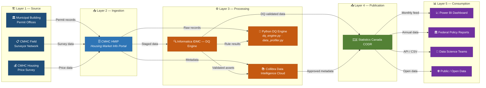

# 🏠 Canadian Housing Data Governance & Quality Framework

**Author:** Ram Krishna Dhakal   
**Tools:** SQL · Python · Collibra (concepts) · Informatica IDMC (concepts)  
**Dataset:** CMHC Housing Starts — Canada (2018–2023) | 10,800 records · 16 columns · 10 provinces  
**Status:** ✅ Complete

---

## 📌 Project Overview

This project implements an **enterprise-grade Data Governance and Data Quality Framework** applied to a publicly available Canadian housing dataset modelled after Canada Mortgage and Housing Corporation (CMHC) open data.

## Dataset Note
This project uses a synthetic dataset modelled after CMHC public housing starts data (Statistics Canada Table 34-10-0143-01). Same schema and value domains as the published dataset. Realistic DQ issues introduced intentionally for governance demonstration. The dataset covers 10 Canadian provinces; territories (NT, YT, NU) are included in the valid domain but are not present in the current dataset.
Real data: https://www150.statcan.gc.ca/t1/tbl1/en/tv.action?pid=3410014301

It demonstrates the full governance lifecycle:

> **Source Data → Metadata Catalog → Data Lineage → Stewardship Framework → DQ Rules → DQ Scorecard**

This mirrors the governance framework I helped implement during my Data Quality Analyst internship at CMHC (Sept–Dec 2025), using Informatica IDMC, Collibra, and Databricks SQL.

---

## 📁 Project Structure

```
cmhc-housing-data-governance/
│
├── data/
│   ├── raw/
│   │   └── cmhc_housing_starts_2018_2023.csv   # Source dataset (10,800 records · 16 columns)
│   └── processed/
│       ├── cmhc_housing_starts_remediated.csv   # DQ-validated & remediated output dataset
│       └── dq_exceptions.csv                    # Record-level exception log with rule details
│
├── catalog/
│   ├── asset_catalog.csv           # Dataset-level metadata (ownership, classification, lineage summary)
│   ├── data_dictionary.csv         # Column-level definitions for all 16 fields
│   └── critical_data_elements.csv  # 6 CDEs identified with business justification
│
├── lineage/
│   ├── system_lineage.csv          # End-to-end system lineage (5 layers, 8 nodes)
│   └── cde_column_lineage.csv      # Column-level lineage for all 6 CDEs
│
├── stewardship/
│   ├── roles_and_responsibilities.csv   # 6 governance roles with RACI matrix
│   ├── issue_escalation_matrix.csv      # 4-level severity escalation framework
│   └── stewardship_assignments.csv      # CDE-level owner/steward/custodian assignments
│
├── dq_rules/
│   └── dq_rules_catalog.csv        # 12 DQ rules (SQL logic, pass rates, severity)
│
├── scorecard/
│   ├── dq_scorecard_summary.csv       # Overall DQ scorecard (score, grade, actions)
│   ├── dq_scorecard_by_dimension.csv  # Scores by DQ dimension
│   ├── dq_scorecard_by_cde.csv        # Scores by Critical Data Element
│   ├── dq_execution_scorecard.csv     # Rule-level execution results from dq_engine.py
│   ├── column_profile.csv            # Column-level profiling stats from data_profiler.py
│   ├── domain_validation.csv         # Domain validation results from data_profiler.py
│   └── profile_scorecard.csv         # Profiling scorecard summary from data_profiler.py
│
├── docs/
│   ├── dq_rules_sql.sql              # All 12 DQ rules written as executable SQL
│   ├── dq_execution_report.html      # HTML report generated by dq_engine.py
│   ├── data_profile_report.html      # HTML report generated by data_profiler.py
│   ├── data_lineage_diagram.mermaid  # Mermaid source for the lineage diagram
│   └── data_lineage_diagram.png      # Static PNG export of the lineage diagram
│
├── dq_engine.py                # DQ rules execution engine (runs all 12 rules, remediates, generates report)
├── data_profiler.py            # Automated data profiling (column stats, domain validation, duplicates)
├── report_generator.py         # Centralized HTML report generator (DQ execution + data profile reports)
├── requirements.txt            # Python dependencies
└── README.md
```

---

## 🔑 Key Deliverables

### 1. Metadata Catalog (Collibra-style)
- **16 columns fully documented** with business name, data type, description, valid values, and governance metadata
- **6 Critical Data Elements (CDEs)** identified with business justification:
  - `HOUSING_STARTS` — Primary KPI; used in federal GDP reporting and funding allocation
  - `AVERAGE_PRICE_CAD` — Core affordability metric; drives CMHC mortgage insurance thresholds
  - `REF_DATE` — Core temporal dimension; required for all trend analysis
  - `GEO` — Primary geographic dimension; provincial policy reporting
  - `DWELLING_TYPE` — Housing policy segmentation
  - `INTENDED_MARKET` — Rental vs. ownership market analysis
- **Sensitivity classification** applied: Public / Internal / Confidential
- **Data ownership** mapped: CDO → Data Owner → Data Steward → Custodian

### 2. Data Lineage (5-Layer End-to-End)



> **CDEs traced end-to-end:** `HOUSING_STARTS` · `AVERAGE_PRICE_CAD` · `REF_DATE` · `GEO` · `DWELLING_TYPE` · `INTENDED_MARKET`

- **Column-level lineage** documented for all 6 CDEs
- Transformations, business rules, and DQ checks mapped per hop

### 3. Stewardship Framework
- **6 governance roles** defined: CDO, Data Owner, Data Steward, Custodian, Consumer, DGO
- **RACI matrix** for 4 governance activities
- **4-level issue escalation matrix** (Low → Medium → High → Critical)
- **CDE-level stewardship assignments** with review cycles and DQ thresholds

### 4. Data Quality Rules (12 Rules, SQL)
| Rule ID | Rule Name | Dimension | Pass Rate | Status |
|---------|-----------|-----------|-----------|--------|
| DQ-001 | Housing Starts Completeness | Completeness | 98.12% | ⚠ WARN |
| DQ-002 | Housing Starts Non-Negative | Validity | 97.16% | ⚠ WARN |
| DQ-003 | Average Price Completeness | Completeness | 98.76% | ⚠ WARN |
| DQ-004 | Average Price Non-Negative | Validity | 98.92% | ⚠ WARN |
| DQ-005 | Average Price Ceiling | Validity | 100.00% | ✅ PASS |
| DQ-006 | GEO_CODE Referential Integrity | Validity | 100.00% | ✅ PASS |
| DQ-007 | Dwelling Type Domain Validity | Validity | 100.00% | ✅ PASS |
| DQ-008 | Intended Market Domain Validity | Validity | 100.00% | ✅ PASS |
| DQ-009 | Reference Date Format | Validity | 100.00% | ✅ PASS |
| DQ-010 | Grain Uniqueness | Uniqueness | 100.00% | ✅ PASS |
| DQ-011 | Reference Date Not Future | Validity | 100.00% | ✅ PASS |
| DQ-012 | Status Code Validity | Validity | 100.00% | ✅ PASS |

### 5. DQ Scorecard
| Metric | Value |
|--------|-------|
| **Overall DQ Score** | **99.41%** |
| Overall Grade | B |
| Total Records | 10,800 |
| Total Rules Executed | 12 |
| Rules PASS / WARN / FAIL | 8 / 4 / 0 |
| Total Rule Failures | 761 (745 unique records) |
| Completeness Score | 98.44% (B) |
| Validity Score | 99.56% (A) |
| Uniqueness Score | 100.00% (A) |
| **CDEs Requiring Remediation** | HOUSING_STARTS, AVERAGE_PRICE_CAD |

### 📊 Live HTML Reports

| Report | Description |
|--------|-------------|
| [**DQ Execution Report**](https://rkdhakal.github.io/cmhc-housing-data-governance/docs/dq_execution_report.html) | 12 DQ rules execution results, root cause analysis, remediation actions |
| [**Data Profile Report**](https://rkdhakal.github.io/cmhc-housing-data-governance/docs/data_profile_report.html) | Column-level profiling, domain validation, duplicate analysis, DQ scorecard |

---

## 🛠 Tools & Technologies Used

| Tool | Usage in This Project |
|------|-----------------------|
| **Python (pandas, numpy)** | Data profiling, DQ rule execution, scorecard calculation |
| **SQL** | All 12 DQ rules written as executable SQL queries |
| **Collibra** *(conceptual)* | Metadata catalog structure, stewardship workflows, governance roles modelled after Collibra's framework |
| **Informatica IDMC** *(conceptual)* | DQ rule design and exception management patterns modelled after IDMC |
| **CSV / Excel-ready outputs** | All artifacts exportable to Power BI or governance platforms |

---

## 🚀 How to Run

```bash
# Clone the repository
git clone https://github.com/rkdhakal/cmhc-housing-data-governance.git
cd cmhc-housing-data-governance

# Install dependencies
pip install -r requirements.txt

# Run the Data Profiler (generates column stats, domain validation, HTML report)
python data_profiler.py

# Run the DQ Engine (executes 12 rules, remediates data, generates scorecard & report)
python dq_engine.py

# (Optional) Regenerate both HTML reports from saved CSVs
python report_generator.py
```

**Outputs:**
- `docs/data_profile_report.html` — Interactive data profiling report ([view live](https://rkdhakal.github.io/cmhc-housing-data-governance/docs/data_profile_report.html))
- `docs/dq_execution_report.html` — DQ rules execution report with root cause analysis ([view live](https://rkdhakal.github.io/cmhc-housing-data-governance/docs/dq_execution_report.html))
- `docs/data_lineage_diagram.mermaid` — Data lineage diagram (also rendered in README below)
- `data/processed/cmhc_housing_starts_remediated.csv` — Cleaned dataset with DQ flags
- `data/processed/dq_exceptions.csv` — Record-level exception log

---

## 💡 Business Value Delivered

- Identified **761 rule-level data quality exceptions** across 2 CDEs (745 unique records), requiring steward remediation
- Documented **complete end-to-end lineage** enabling audit traceability from source permit to federal policy report
- Established **governance operating model** that can be applied to any regulated dataset
- Produced **ready-to-import catalog artifacts** compatible with Collibra Data Intelligence Cloud

---

## 📬 Contact

**Ram Krishna Dhakal**  
Data Quality & Governance Analyst | Toronto, ON  
📧 dramkrishna19@gmail.com  
🔗 linkedin.com/in/ramkrishnadhakal
